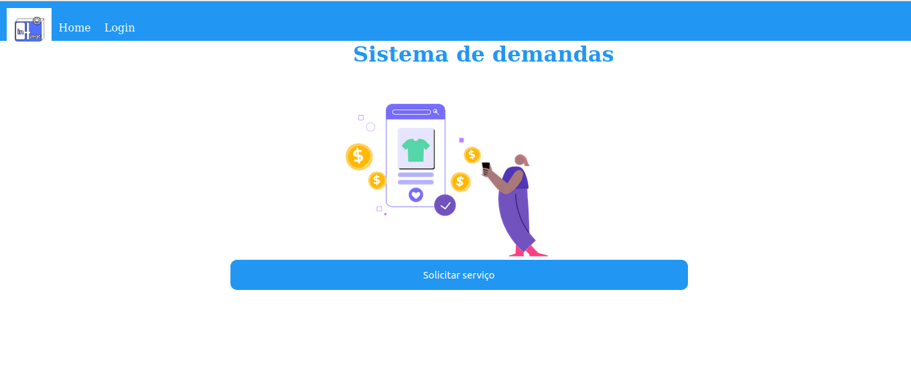

## Para baixar o projeto siga os seguintes passos; 
### acesse link do repositório e clone na sua maquina
### de "npm install" para baixar todas as dependências 
### rode "npm run dev" para ver o projeto no seu localhost

## sistema 

## Features:
* login - /
* logt - /
* recuperar senha - X
* solicitar serviço - X

* dashboard ADM - OK
* dashboard colaborador responsável - OK
* dashboard colaborar usuário - OK

* cadastro do usuário - OK
* ver usuário - OK
* edição de perfil de todos os tipos de usuário - OK
* excluir  usuário - X
* pesquisar usuário  - X
* filtrar usuário  - OK

* cadastro de demanda - OK
* ver de demanda - OK
* pesquisar de demanda - X
* filtrar de demanda - OK
* excluir  demanda - X

* execução de demandas pendentes  - OK
* execução de demandas em andamento  - OK
* envio ao ADM demanda pendente - X

## tecnologias utilizadas
### Tecnologias utilizadas:

* [React](https://pt-br.legacy.reactjs.org/docs/getting-started.html): biblioteca de interfaces
* [Axios](https://axios-http.com/ptbr/docs/intro): consumir api
## Projeto para a diciplina de projeto integrador

## designer de baixa fidelidade do projeto <a href='https://www.figma.com/file/4UhqLkG3d6X2pVzQiIdVNh/Untitled?node-id=0%3A1&t=FxCvtT3gVlNmIHoR-0'>Aqui</a>
## designer de alta fidelizade do projeto <a href='https://www.figma.com/file/RiwZHdRDWFkja1suAZRDZr/DEMANDA-DE-SERVI%C3%87OS-E-MATERIAIS?node-id=6-6&t=qET8nXZ5chtM3Xi2-0'>aqui</a>
## termo do projeto <a href=''>aqui</a>
## api do projeto <a href=''>aqui</a>